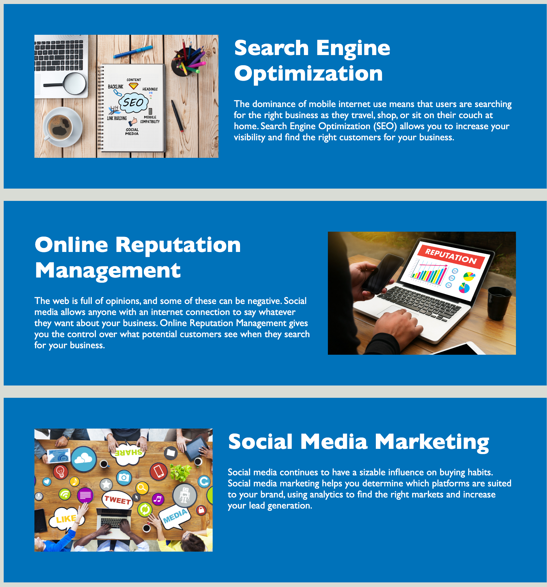
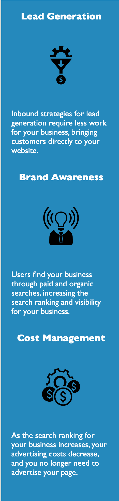

# 01-html-css-git

## Description

For this project, a marketing agency has "hired" me to refactor an existing site with the goal of making it more accessible. Accessibility ensures that people with disabilities can access a website using assistive technologies. Also, accessible sites are optimized for search engines meaning they will rank higher. I have learned that being as specific as possible with the semantic HTML elements, instead of using < div > for everything, as well as with the site title and the image alt attributes can help solve the accessibility issue. So can structuring both the HTML and CSS pages in a logical order making it easier to read. 

## Table of Contents 

- [Installation](#installation)
- [Usage](#usage)
- [Credits](#credits)
- [License](#license)

## Installation

N/A

## Usage
This site contains information pertaining to online marketing. To view the main set of information, you can either scroll down on the page, or you can click the three header navigation links to take you directly to the information you need as pictured here: 

Navigation Links

Information

There is also a sidebar with useful tips found next so the main section of information. You can get here by scrolling down on the page. 

Sidebar Tips

The finished site image:

The finished site link:

## Credits

N/A

## License

MIT License